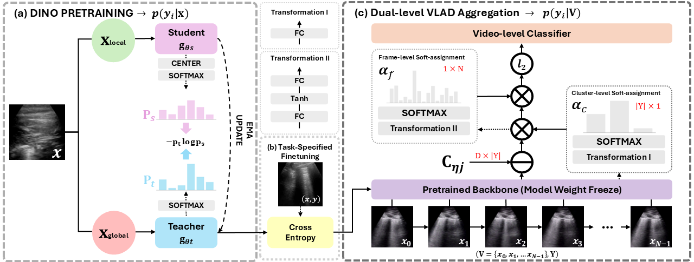

# MeDiVLAD: Efficient Lung Ultrasound Severity Scoring

<div align="center">
  
</div>

This repository contains the official implementation of the paper **"Efficient Lung Ultrasound Severity Scoring Using Dedicated Feature Extractor"**

## Timeline

- **2025-01-02**: Accepted by **IEEE International Symposium on Biomedical Imaging [(ISBI)](https://biomedicalimaging.org/2025/) 2025** 🎉🎉.
- **2025-01-23**: Our paper (Camera Ready Version) is now avaliable on **[arXiv](https://arxiv.org/abs/2501.12524)** 🎉🎉.

## Abstract

Lung ultrasound (LUS) has become an invaluable tool for assessing pulmonary conditions due to its non-invasive nature and portability. However, AI-driven LUS severity scoring faces challenges from limited datasets and annotation constraints. To address this, we introduce **MeDiVLAD**, a semi-self-supervised learning pipeline leveraging:

1. **Self-knowledge distillation** to pretrain a Vision Transformer (ViT) without labeled data.
2. **Dual-level VLAD aggregation** to capture temporal and spatial patterns for frame- and video-level scoring.

The proposed method achieves state-of-the-art performance in both frame- and video-level scoring tasks, significantly reducing the reliance on expert annotations.

## Features

- **Self-supervised Pretraining**: Employs DINO to pretrain the ViT model without labeled data.
- **Dual-level VLAD Aggregation**: Improves the representation of frame embeddings for robust video-level classification.
- **Minimal Supervision**: Requires only a small amount (or No data) of annotated data for fine-tuning.
- **Interpretability**: Produces precise attention maps to enhance classification reasoning.

## Key Results

<div align="center">
  
</div>

- **Frame-level Accuracy**: 75.05% (without labeled data), improving to 82.47% with fine-tuning.
- **Video-level Classification**: Outperforms Bi-LSTM and NetVLAD on the LUS severity scoring task.
- **Applications**: Supports critical pathology identification and broader medical imaging tasks.

## Dataset

The experiments use a curated dataset of 283 ultrasound videos from 156 patients, including data from:
- [COVIDx-US](https://arxiv.org/abs/2103.10003)
- Private dataset collected from "G. Papanikolaou" General Hospital, Thessaloniki, Greece.

<div align="center">
  
</div>

Frame-level annotations include 585 images categorized into three severity levels using an enhanced LUS scoring system.

## Installation and Usage

### Our Environment Setting (Recommended)

- **Python**: 3.9
- **PyTorch**: 2.0.0
- **TorchVision**: 0.15.0

### Installation

1. Clone this repository:
   ```bash
   git clone https://github.com/GuoJiaqi-1020/MeDiVLAD.git
   cd MeDiVLAD
    ```
2. **Download** Dataset (image & video) and pretrained models from: [Google Drive](https://drive.google.com/drive/folders/1AXQTMSz7IMpgTpSAbcOGF-TW1Py9CUfC?usp=sharing)

   - `15_frames.zip`: Original video data (15 frame rate) in .avi
   - `15_frames_processed.zip`: Preprocessed video data in .npy
   - `labeled_frames.zip`: Frame-level labeled data
   - `dino_checkpoint.zip`: Pretrained models

3. **Unzip the files:** 
   ```
   MeDiVLAD
   ├── dino_checkpoint
   │   ├── backbone
   │   ├── classifier
   ├── data
   │   ├── 15_frames
   │   ├── 15_frames_processed
   │   ├── labeled_frames
   │   ├── video_list.csv (already included)
   └── img
    ```
4. **Running the test scripts**

   All runnable scripts are located in the `MeDiVLAD/Medino/` directory. Below are the descriptions of the main scripts and their purposes:
   
   | Script Name        | Purpose                                                                         |
   |--------------------|---------------------------------------------------------------------------------|
   | `dino_train.py`    | Performs DINO self-distillation. Uses KNN as a classifier to evaluate accuracy. |
   | `lus_image_cls.py` | Fine-tunes the distilled DINO teacher.                                          |
   | `lus_video_cls.py` | For video-level scoring.                                                        |
   
   🟥 Don't forget to modify the data path in the script. Please follow the comments in the script.


5. **Checkpoint Description**

   The following table provides the expected accuracy for each script based on the classifier type (KNN or Linear):
   
   | Checkpoint                                | KNN   | Linear | Purpose                           |
   |-------------------------------------------|-------|------|-----------------------------------|
   | backbone/Teacher_DINO_IMGLUS_Acc67.49.pth | ~63 % | N/A  | self-distilled backbone (No label) |
   | backbone/VAL_F1_dino_acc_8013.pth         | N/A   | ~80% | fine-tuned on fold 1              |
   | backbone/VAL_F2_dino_acc_8481.pth         | N/A   | ~84% | fine-tuned on fold 2              |
   | video_cls/VAL_F1_dino_acc_8357.pth        | N/A   | ~83% | Video-level scoring on fold 1     |
   | video_cls/VAL_F2_dino_acc_8162.pth        | N/A   | ~81% | Video-level scoring on fold 2     |

### 📖 Citing This Work
If you find anything that is helpful to your research (dataset/code), please cite our paper.

*(We will update this arxiv reference after the official publication of the paper)*

```bibtex
@misc{guo2025efficientlungultrasoundseverity,
      title={Efficient Lung Ultrasound Severity Scoring Using Dedicated Feature Extractor}, 
      author={Jiaqi Guo and Yunnan Wu and Evangelos Kaimakamis and Georgios Petmezas and Vasileios E. Papageorgiou and Nicos Maglaveras and Aggelos K. Katsaggelos},
      year={2025},
      eprint={2501.12524},
      archivePrefix={arXiv},
      primaryClass={eess.IV},
      url={https://arxiv.org/abs/2501.12524}, 
}
```